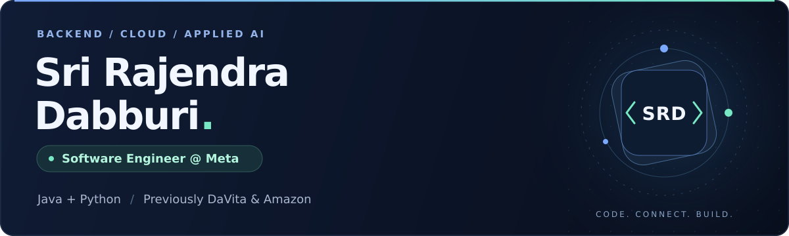

  

  <strong>Building reliable backends. Exploring intelligent systems.</strong>

  <a href="https://www.linkedin.com/in/sri-rajendra/"><strong>LinkedIn ↗</strong></a>
  &nbsp; · &nbsp;
  <a href="https://sri-rajendra.rajendra1818.chatgpt.site/"><strong>Portfolio ↗</strong></a>
  &nbsp; · &nbsp;
  <a href="mailto:rajendradabburi@gmail.com"><strong>Email ↗</strong></a>
  &nbsp; · &nbsp;
  <a href="#selected-projects"><strong>Projects ↓</strong></a>

---

## A little about me

I'm **Sri Rajendra**, a software engineer based in **Overland Park, Kansas**. I work across backend systems, cloud services, and AI engineering workflows, with experience at **Meta, DaVita, and Amazon**.

At **Meta**, I support GenAI initiatives through **Python development, data pipelines, automation, and tooling for AI model training workflows**. My foundation is in Java, Spring Boot, event-driven services, and turning complex integrations into maintainable software.

I care about **reliability, clear APIs, developer experience, and useful automation**. Alongside work, I'm pursuing an **M.S. in Computer Science at the University of Central Missouri**, with graduation expected in **December 2026**.

## Experience

| Where | When | Engineering focus |
| :--- | :--- | :--- |
| **Meta** Software Engineer | Aug 2025 – Present | Python, GenAI data pipelines, automation, tooling, and workflows supporting AI model training. |
| **DaVita Kidney Care** Software Developer | Aug 2023 – Jul 2025 | Healthcare integrations; Java 11 → 21 and Spring Boot 2 → 3 modernization; Kafka pipelines; authentication with Keycloak and OAuth. |
| **Amazon Web Services** Software Development Engineer | Aug 2022 – Aug 2023 | REST APIs and cloud services on EC2, S3, and Lambda, with CloudWatch monitoring and a focus on fault tolerance. |

## Selected projects

Three independent repositories with source code, setup instructions, and automated checks.

<table>
  <tr>
    <td width="33%" valign="top">
      <h3>01 · Orderflow API</h3>
      
<strong>Java · Spring Boot · JUnit</strong>

      
An order workflow API with request validation, precise totals, atomic state transitions, filtering, and integration tests.

      
Demonstrates API design and business rules. Uses in-memory storage.

      
<a href="https://github.com/rajendra-1818/orderflow-api"><strong>Explore repository →</strong></a>

    </td>
    <td width="33%" valign="top">
      <h3>02 · DocuFlow AI</h3>
      
<strong>Python · FastAPI · SQLite</strong>

      
A local document search API with persistent storage, TF-IDF ranking, scored excerpts, and retrieval tests.

      
Demonstrates a testable retrieval pipeline. Uses lexical search, without an LLM.

      
<a href="https://github.com/rajendra-1818/docuflow-ai"><strong>Explore repository →</strong></a>

    </td>
    <td width="33%" valign="top">
      <h3>03 · OpsBoard</h3>
      
<strong>React · TypeScript · Vite</strong>

      
A responsive operations dashboard with service search, health filters, incident views, and CSV export.

      
Demonstrates frontend interaction and typed UI development. Uses fictional sample data.

      
<a href="https://github.com/rajendra-1818/opsboard-react"><strong>Explore repository →</strong></a>

    </td>
  </tr>
</table>

## Engineering toolkit

| Area | Technologies |
| :--- | :--- |
| **Languages** | Java · Python · SQL · JavaScript · TypeScript |
| **Backend & APIs** | Spring Boot · Spring MVC · REST · OpenAPI · FastAPI |
| **Events & integration** | Apache Kafka · Amazon SQS · SNS · API Gateway |
| **Cloud & containers** | AWS · GCP · Docker · Kubernetes |
| **Data** | PostgreSQL · MongoDB · Redis · SQLite |
| **Security** | OAuth 2.0 · JWT · Keycloak |
| **Testing & delivery** | JUnit · MockMvc · pytest · GitHub Actions · Jenkins · Gradle · Maven · Git |
| **Observability** | CloudWatch · Dynatrace · Kibana · Splunk |
| **Recent project work** | React · TypeScript · Vite · FastAPI · scikit-learn · TF-IDF retrieval |

## What I'm exploring

- **Applied AI:** retrieval-augmented generation, LLM applications, Claude API, Amazon Bedrock, and MongoDB AI tooling.
- **Backend & platform engineering:** distributed systems, event-driven architectures, reliability, and developer tooling.
- **Cloud systems:** Spring Cloud, Kubernetes, and maintainable service design.

  
<strong>Education & continued learning</strong>

### Education

- **M.S. in Computer Science** — University of Central Missouri · Expected December 2026
- **B.S. in Computer Science** — University of Central Missouri · 2022 · Cum Laude

### Certifications & courses

- Building with the Claude API
- Claude with Amazon Bedrock
- Building RAG Apps Using MongoDB
- Building AI Agents with MongoDB
- AWS Academy Cloud Developing
- DevOps with AWS
- Fundamentals of Machine Learning and Artificial Intelligence

---

  <strong>Let's build something useful.</strong> 
  Interested in backend, platform, or GenAI engineering? <a href="mailto:rajendradabburi@gmail.com">Let's connect.</a>

